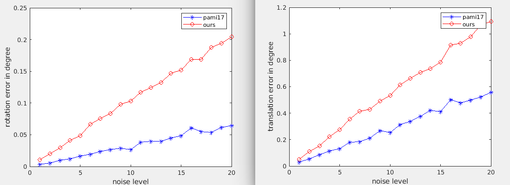
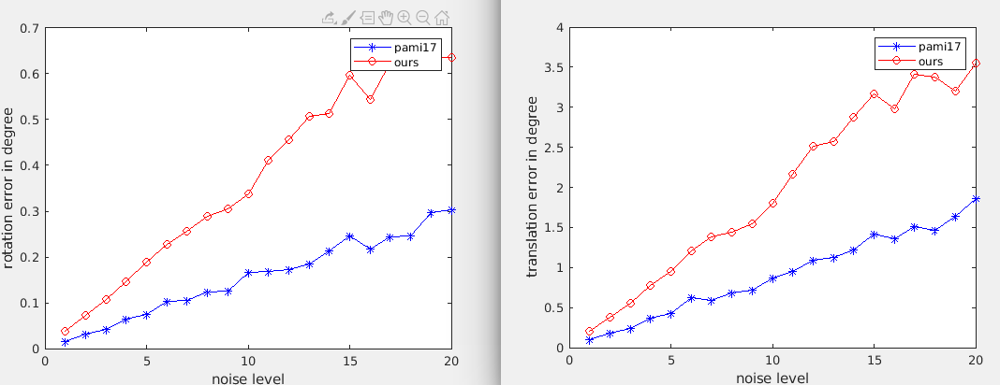

# Homography to Rotation and translation

This project reproduce the [function in opencv](https://github.com/opencv/opencv/blob/master/modules/calib3d/src/homography_decomp.cpp), the method one and method three in paper "Homography Based Egomotion Estimation with a Common Direction" and some ours idea.

Here are some our results

